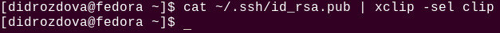
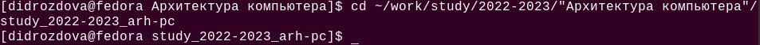
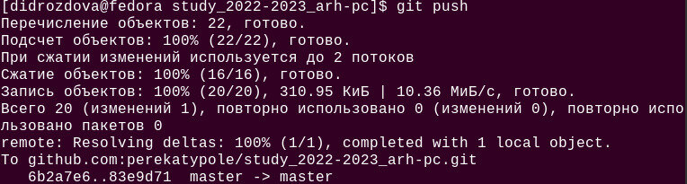

---
## Front matter
title: "Отчет по лабораторной работе № 2"
subtitle: "Дисциплина: Архитектура компьютера"
author: "Дроздова Дарья Игоревна"

## Generic otions
lang: ru-RU
toc-title: "Содержание"

## Bibliography
bibliography: bib/cite.bib
csl: pandoc/csl/gost-r-7-0-5-2008-numeric.csl

## Pdf output format
toc: true # Table of contents
toc-depth: 2
fontsize: 12pt
linestretch: 1.5
papersize: a4
documentclass: scrreprt

## I18n polyglossia
polyglossia-lang:
  name: russian
  options:
	- spelling=modern
	- babelshorthands=true
polyglossia-otherlangs:
  name: english
## I18n babel
babel-lang: russian
babel-otherlangs: english
## Fonts
mainfont: PT Serif
romanfont: PT Serif
sansfont: PT Sans
monofont: PT Mono
mainfontoptions: Ligatures=TeX
romanfontoptions: Ligatures=TeX
sansfontoptions: Ligatures=TeX,Scale=MatchLowercase
monofontoptions: Scale=MatchLowercase,Scale=0.9
## Biblatex
biblatex: true
biblio-style: "gost-numeric"
biblatexoptions:
  - parentracker=true
  - backend=biber
  - hyperref=auto
  - language=auto
  - autolang=other*
  - citestyle=gost-numeric
## Pandoc-crossref LaTeX customization
figureTitle: "Рис."
tableTitle: "Таблица"
listingTitle: "Листинг"
lofTitle: "Список иллюстраций"
lotTitle: "Список таблиц"
lolTitle: "Листинги"
## Misc options
indent: true
header-includes:
  - \usepackage{indentfirst}
  - \usepackage{float} # keep figures where there are in the text
  - \floatplacement{figure}{H} # keep figures where there are in the text
---

# Цель работы

Целью данной лабораторной работы является: 1) изучение идеологии и применение
средств контроля версий git, 2) приобретение практических навыков по работе с
системой git.

# Выполнение лабораторной работы

1. **Базовая настройка git**
   1. Первым шагом делаем предварительную конфигурацию git через (с помощью
команды git config --global user.name и git config --global user.email указаваем
имя и email владельца репозитория):
  
   { width=70% }
  
   2. Затем настраиваем utf-8 в выводе сообщений git, задаем имя начальной
ветке(master), и настраиваем параметр autocrlf и safecrlf:
  
   { width=70% }
  
2. **Создание SSH ключа**
 
   1. Генерируем пару ключей (приватный и открытый), чтобы идентифицировать
пользователя на сервере репозиториев:
  
   { width=80% }
  
   2. Ключи сохраняем в каталоге ~/.ssh/ и загружаем сгенерированный открытый
ключ на личную учетную запись в github. Для это копируем ключ командой
cat ~/.ssh/id_rsa.pub | xclip -sel clip:

   { width=80% }
   
   Создаем новый SSH ключ и вставляем сгенерированный открытый ключ,
указываем название новому ключу(arch-pc):
  
   { width=70% } 
  
3. **Создание рабочего пространства и репозитория курса
на основе шаблона**

   1. Для выполнения лабораторных работ создаем иерархическую структуру
рабочего пространства. Через терминал и создаем каталог для предмета
«Архитектура компьютера»:

   { width=80% }
  
4. **Создание репозитория курса на основе шаблона**

   1. Для клонирования репозитория переходим на станицу репозитория с шаблоном
курса https://github.com/yamadharma/course-directory-student-template и выбираем
Use this template. В открывшемся окне задаем имя репозитория study_2022–
2023_arh-pc и создаем репозиторий:

   { width=70% }
  
   2. С помощью терминала и переходим в каталог курса "Архитектура
компьютера" и клонируем созданный репозиторий:
  
   { width=80% }
   
5. **Настройка каталога курса**
   1. Переходим в каталог курса и удаляем лишние файлы:
  
   { width=80% }
   
   2. Удаляем и создаем необходимые каталоги с помощью команд, изученных
ранее(в лабораторной работе 1):

   { width=80% }
   
   3. Отправляем файлы на сервер с помощью команд последовательного введения
команд: 1)подготавливаем файлы к коммиту, 2)создаем коммит, 3)отправляем
изменения на сервер:

   { width=80% }
   
   { width=80% }
   
6. **Задание для самостоятельной работы**
   
   1. Готовим рабочее пространство, переносим сделанные ранее лабораторные
работы в предназначенные для этого каталоги:

   { width=80% }

   2. С помощью команды cp копируем первую лабораторную работу и
переносим в labs/lab01/report, проверяем корректность выполнения:

   { width=70% }

   3. Загружаем файлы на github:
   
   { width=70% }

# Выводы

В ходе выполнения данной лабораторной работы мне удалось изучить
идеологию и применить средства контроля версий git, а так же приобрести
практические навыки по работе с системой git.

