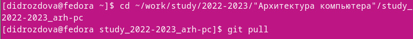
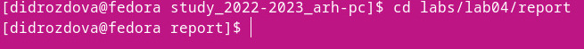
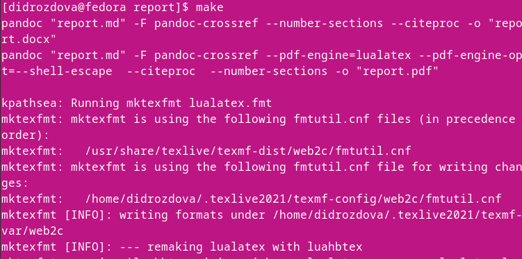
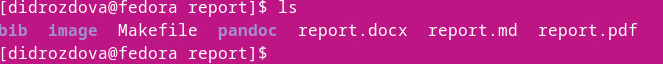
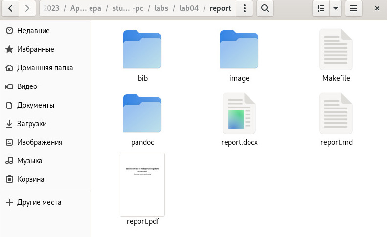
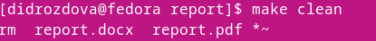
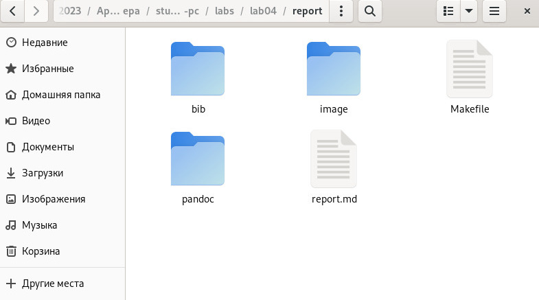
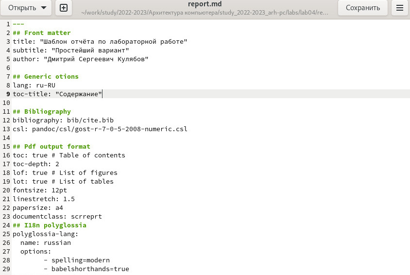

---
## Front matter
title: "Отчет по лабораторной работе № 3"
subtitle: "Дисциплина: Архитектура компьютера"
author: "Дроздова Дарья Игоревна"

## Generic otions
lang: ru-RU
toc-title: "Содержание"

## Bibliography
bibliography: bib/cite.bib
csl: pandoc/csl/gost-r-7-0-5-2008-numeric.csl

## Pdf output format
toc: true # Table of contents
toc-depth: 2
fontsize: 12pt
linestretch: 1.5
papersize: a4
documentclass: scrreprt

## I18n polyglossia
polyglossia-lang:
  name: russian
  options:
	- spelling=modern
	- babelshorthands=true
polyglossia-otherlangs:
  name: english
## I18n babel
babel-lang: russian
babel-otherlangs: english
## Fonts
mainfont: PT Serif
romanfont: PT Serif
sansfont: PT Sans
monofont: PT Mono
mainfontoptions: Ligatures=TeX
romanfontoptions: Ligatures=TeX
sansfontoptions: Ligatures=TeX,Scale=MatchLowercase
monofontoptions: Scale=MatchLowercase,Scale=0.9
## Biblatex
biblatex: true
biblio-style: "gost-numeric"
biblatexoptions:
  - parentracker=true
  - backend=biber
  - hyperref=auto
  - language=auto
  - autolang=other*
  - citestyle=gost-numeric
## Pandoc-crossref LaTeX customization
figureTitle: "Рис."
tableTitle: "Таблица"
listingTitle: "Листинг"
lofTitle: "Список иллюстраций"
lotTitle: "Список таблиц"
lolTitle: "Листинги"
## Misc options
indent: true
header-includes:
  - \usepackage{indentfirst}
  - \usepackage{float} # keep figures where there are in the text
  - \floatplacement{figure}{H} # keep figures where there are in the text
---

# Цель работы

Целью данной лабораторной работы является освоение процедуры оформления отчетов с помощью языка разметки Markdown, а также знакомство с основными возможностями разметки Markdown.
 
# Выполнение лабораторной работы

1. **Порядок выполнения лабораторной работы**
   1. Открываем терминал и с помощью команды *cd* переходим в каталог курса, сформированный в ходе выполнения лабораторной работы №3 и обновляем локальный репозиторий, скачивая изменения из удаленного:
  
   { width=70% }
  
   2. После обновления репозитория Перейдитепереходим в каталог с шаблоном отчета по лабораторной работе №4:
  
   { width=70% }
  
   3. И проводим компиляцию шаблона с использованием *Makefile* командой *make*:
  
   { width=70% }
  
   При успешной компиляции мы должны получить сгенерированные файлы *report.pdf* и
*report.docx*. Проверим корректность полученных файлов:

   { width=70% }
  
   { width=70% } 
  
   4. Удаляем файлы, полученные в ходе компиляции. Для этого используем команду *make clean*:
  
   { width=70% }
  
   Проверяем корректность выполнения:
  
   { width=70% }
  
   5. Открываем файл *report.md* для изучения в целях дальнейшего использования в качестве шаблона для отчетов по лабораторным работам:   
  
   { width=70% }
  
   { width=70% }

2. **Задание для самостоятельной работы**
   1. В соответствующем каталоге(*/study_2022-2023_arh-pc/labs/lab03/report*) делаем отчёт по лабораторной работе №3 в формате *Markdown*, используя шаблон.
   2. Загружаем файлы на github.

# Выводы

В ходе выполнения практических заданий “Лабораторной работы №3” я
приобрела навыки оформления отчетов с помощью языка разметки Markdown.

