---
## Front matter
title: "Отчет по лабораторной работе № 4"
subtitle: "Дисциплина: Архитектура компьютера"
author: "Дроздова Дарья Игоревна"

## Generic otions
lang: ru-RU
toc-title: "Содержание"

## Bibliography
bibliography: bib/cite.bib
csl: pandoc/csl/gost-r-7-0-5-2008-numeric.csl

## Pdf output format
toc: true # Table of contents
toc-depth: 2
fontsize: 12pt
linestretch: 1.5
papersize: a4
documentclass: scrreprt

## I18n polyglossia
polyglossia-lang:
  name: russian
  options:
	- spelling=modern
	- babelshorthands=true
polyglossia-otherlangs:
  name: english
## I18n babel
babel-lang: russian
babel-otherlangs: english
## Fonts
mainfont: PT Serif
romanfont: PT Serif
sansfont: PT Sans
monofont: PT Mono
mainfontoptions: Ligatures=TeX
romanfontoptions: Ligatures=TeX
sansfontoptions: Ligatures=TeX,Scale=MatchLowercase
monofontoptions: Scale=MatchLowercase,Scale=0.9
## Biblatex
biblatex: true
biblio-style: "gost-numeric"
biblatexoptions:
  - parentracker=true
  - backend=biber
  - hyperref=auto
  - language=auto
  - autolang=other*
  - citestyle=gost-numeric
## Pandoc-crossref LaTeX customization
figureTitle: "Рис."
tableTitle: "Таблица"
listingTitle: "Листинг"
lofTitle: "Список иллюстраций"
lotTitle: "Список таблиц"
lolTitle: "Листинги"
## Misc options
indent: true
header-includes:
  - \usepackage{indentfirst}
  - \usepackage{float} # keep figures where there are in the text
  - \floatplacement{figure}{H} # keep figures where there are in the text
---

# Цель работы

Целью данной лабораторной работы является освоение процедуры компиляции и сборки программ, написанных на языке ассемблере NASM.
 
# Выполнение лабораторной работы

1. **Порядок выполнения лабораторной работы**
   1. *Программа Hello world!*
      - Создаем каталог для работы с программами на языке ассемблера NASM и переходим в созданный каталог:
      
      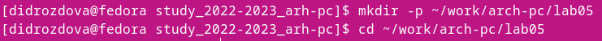{ width=70% }
      
      - Создаем текстовый файл с именем hello.asm и открываем с помощью текстового редактора gedit:
      
      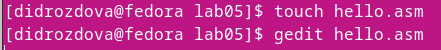{ width=70% }
      
      - Вводим в файле следующий текст:
      
      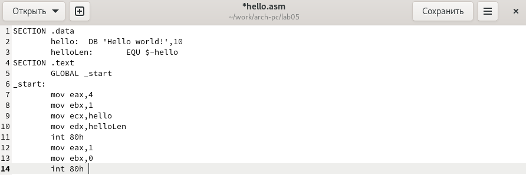{ width=70% }
      
   2. *Транслятор NASM*
      - Для компиляции написанного в файле *hello.asm* текста программы «Hello World» необходимо написать следующий текст и, используя команду *ls*, проверить, что объектный файл создан:
      
      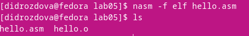{ width=70% }
      
      С помощью написанной выше команды транслятор преобразует текст
программы из файла hello.asm в объектный код, который запишется в файл
hello.o. 
    
   3. *Расширенный синтаксис командной строки NASM*
      - Компилируем исходный файл hello.asm в obj.o(-o) и создаем файл листинга list.lst(-l) и с помощью команды *-ls* проверяем, что файлы были созданы:
      
      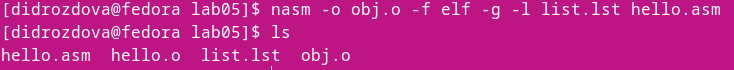{ width=70% }
      
2. **Компоновщик LD**
      - Чтобы получить исполняемую программу,
объектный файл необходимо передать на обработку компоновщику и с помощью команды *-ls* проверить, что файл *hello* был создан:

      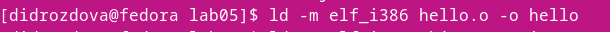{ width=70% }
      
      - Выполняем следующую команду:
      
      { width=70% }
      
      Проверим результат выполненной команды:
      
      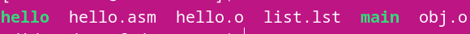{ width=70% }
      
      Исполняемый файл по-прежнему имеет имя *hello*, объектный файл
из которого собран этот исполняемый файл -- *main*.

   1. *Запуск исполняемого файла*
      - Запускаем на выполнение созданный исполняемый файл, находящийся в
текущем каталоге, набрав в командной строке:

      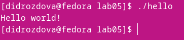{ width=70% }
      
3. **Задание для самостоятельной работы**
      - В каталоге ~/work/arch-pc/lab05 с помощью команды cp создаем копию
файла hello.asm с именем lab5.asm:

      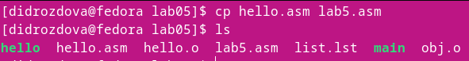{ width=70% }
      
      - С помощью текстового редактора gedit меняем текст про-
граммы в файле lab5.asm так, чтобы вместо "Hello world!" на экран выводилась строка с собственным именем и фамилией:

      { width=70% }
      
      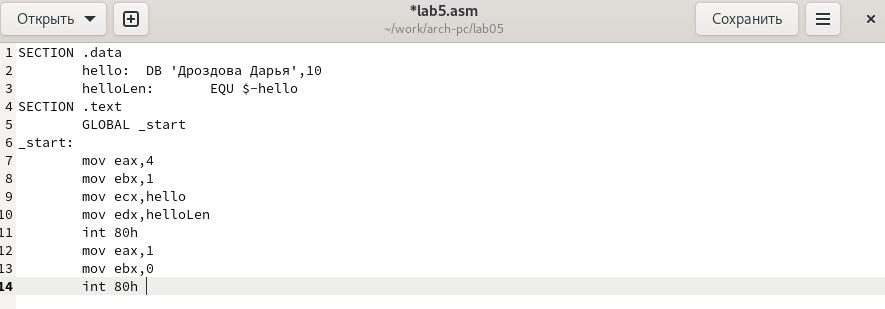{ width=70% }
      
      - Оттранслируем полученный текст программы lab5.asm в объектный
файл и запускаем получившийся исполняемый файл:

      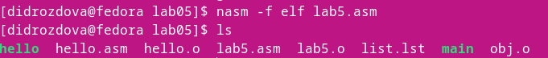{ width=70% }
      
      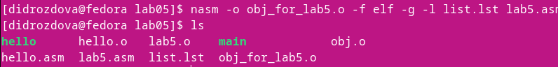{ width=70% }
      
      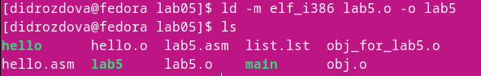{ width=70% }
      
      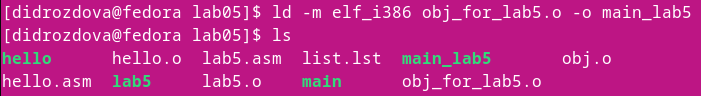{ width=70% }
      
      { width=70% }
      
      - Копируем файлы hello.asm и lab5.asm в собственный локальный репозиторий
в каталог ~/work/study/2022-2023/"Архитектура компьютера"/study_2022-2023_arh-pc/labs/lab04/ и загружаем файлы на Github:
      
      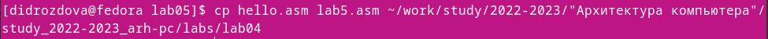{ width=70% }
      
      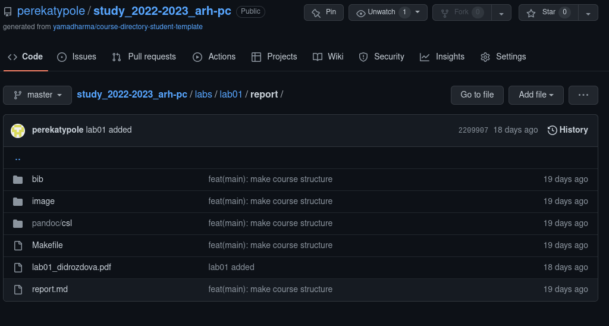{ width=70% }

# Выводы

В ходе выполнения практических заданий “Лабораторной работы №4” я
ознакомилась с синтаксисом ассемблера NASM, а также освоила процедуры компиляции и сборки программ.
