---
## Front matter
title: "Отчет по лабораторной работе № 5"
subtitle: "Дисциплина: Архитектура компьютера"
author: "Дроздова Дарья Игоревна"

## Generic otions
lang: ru-RU
toc-title: "Содержание"

## Bibliography
bibliography: bib/cite.bib
csl: pandoc/csl/gost-r-7-0-5-2008-numeric.csl

## Pdf output format
toc: true # Table of contents
toc-depth: 2
fontsize: 12pt
linestretch: 1.5
papersize: a4
documentclass: scrreprt

## I18n polyglossia
polyglossia-lang:
  name: russian
  options:
	- spelling=modern
	- babelshorthands=true
polyglossia-otherlangs:
  name: english
## I18n babel
babel-lang: russian
babel-otherlangs: english
## Fonts
mainfont: PT Serif
romanfont: PT Serif
sansfont: PT Sans
monofont: PT Mono
mainfontoptions: Ligatures=TeX
romanfontoptions: Ligatures=TeX
sansfontoptions: Ligatures=TeX,Scale=MatchLowercase
monofontoptions: Scale=MatchLowercase,Scale=0.9
## Biblatex
biblatex: true
biblio-style: "gost-numeric"
biblatexoptions:
  - parentracker=true
  - backend=biber
  - hyperref=auto
  - language=auto
  - autolang=other*
  - citestyle=gost-numeric
## Pandoc-crossref LaTeX customization
figureTitle: "Рис."
tableTitle: "Таблица"
listingTitle: "Листинг"
lofTitle: "Список иллюстраций"
lotTitle: "Список таблиц"
lolTitle: "Листинги"
## Misc options
indent: true
header-includes:
  - \usepackage{indentfirst}
  - \usepackage{float} # keep figures where there are in the text
  - \floatplacement{figure}{H} # keep figures where there are in the text

---

# Цель работы

Целью данной лабораторной работы является освоение языка ассемблера mov и int и приобретение практических навыков работы в Midnight Commander.

# Выполнение лабораторной работы

1. Порядок выполнения лабораторной работы
   * С помощью команды mc открываем Midnight Commander и переходим в каталог *~/work/arch-pc* созданный при выполнении лабораторной работы №4:
   
   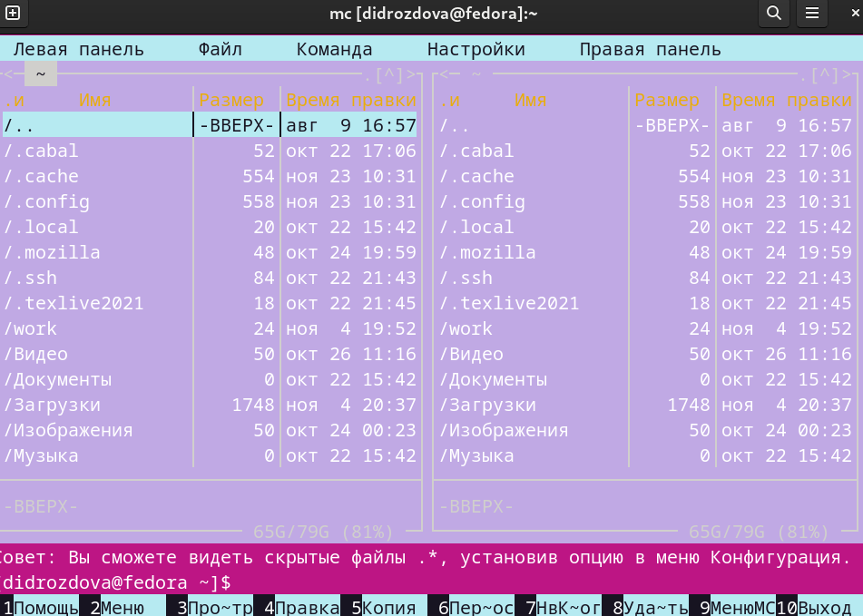{ width=70% }
   
   * Создаем папку lab06 с помощью командной клавиши F7 и переходим в нее после создания:

   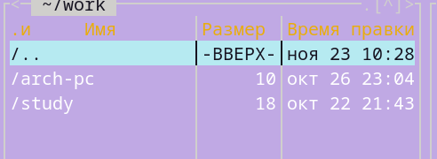{ width=70% }
   
   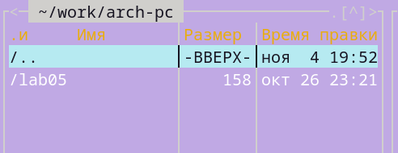{ width=70% }
   
   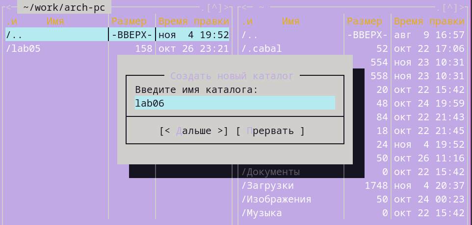{ width=70% }

   * Пользуясь строкой ввода и командой touch, создаем файл lab6-1.asm:
   
   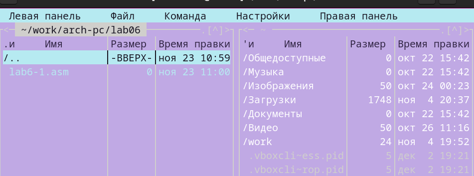{ width=70% }
   
   * Открываем только что созданный файл для редактирования во встроенном редакторе *mcedit* и вводим текст программы, представленный в листинге документа, приложенного к данной лабораторной работе: 
   
   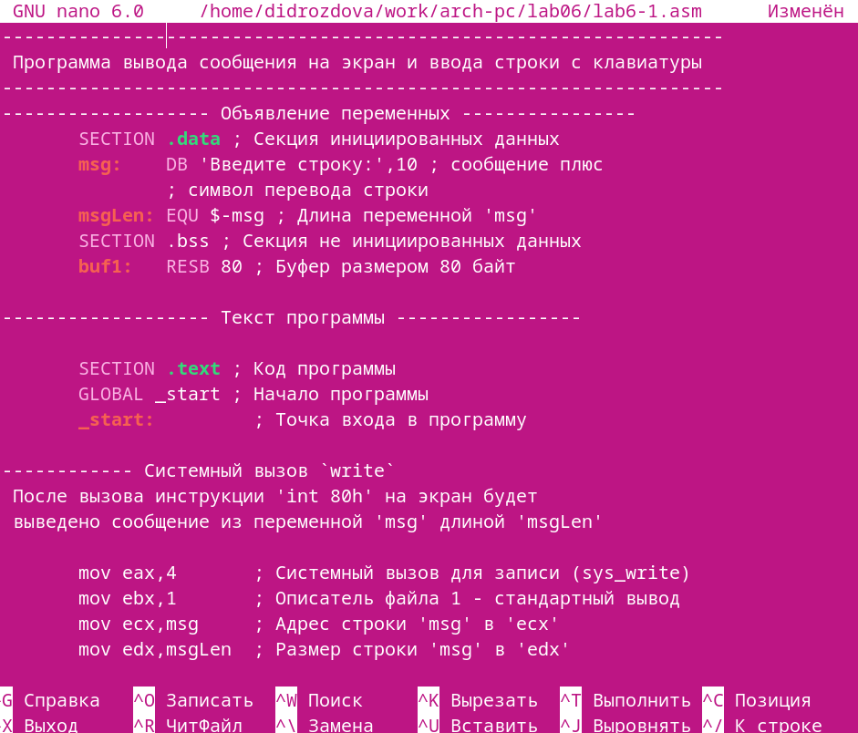{ width=70% }
   
   * Сохраняем файл lab6-1.asm, закрываем его, а после открываем, чтобы убедиться, что текст программы сохранился.
   
   * Далее оттранслируем текст программы lab6-1.asm в объектный файл, сделаем компоновку объектного файла и запустим получившийся исполняемый файл. 
   
   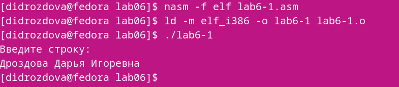{ width=70% }
   
   Программа выводит строку: 'Введите строку:', и ожидает ввода с
клавиатуры. На запрос вводим собственные ФИО.

2. Подключение внешнего файла in_out.asm
   
   * Скачиваем файл in_out.asm со страницы курса в ТУИС. 
   * Сохраняем подключаемый файл in_out.asm в одном каталоге с файлом программы, в которой он используется.
   * В одной из панелей mc открываем каталог с файлом lab6-1.asm, в другой - каталог со скаченным файлом in_out.asm:
   
   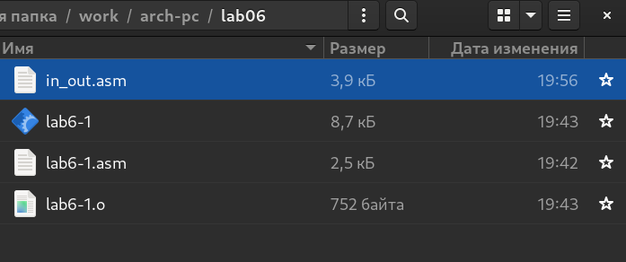{ width=70% }
   
   Копируем файл in_out.asm в каталог с файлом lab6-1.asm
с помощью функциональной клавиши F5: 

   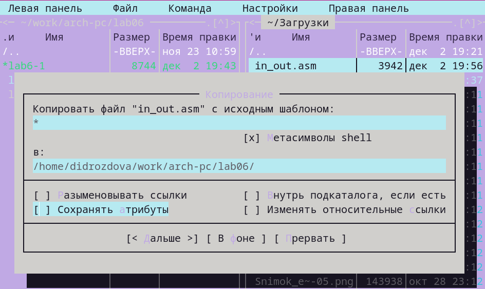{ width=70% }
   
   * С помощью функциональной клавиши F6 создаем копию файла lab6-
1.asm с именем lab6-2.asm:

   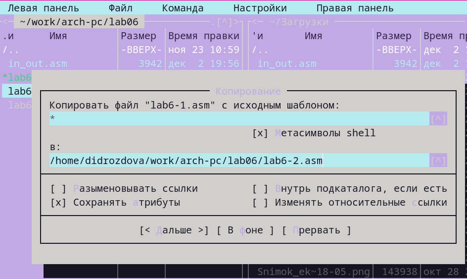{ width=70% }
   
   * Исправляем текст программы в файле lab6-2.asm с использование под-
программ из внешнего файла in_out.asm в соответствии с листингом. Создаем исполняемый файл и проверяем его работу:

   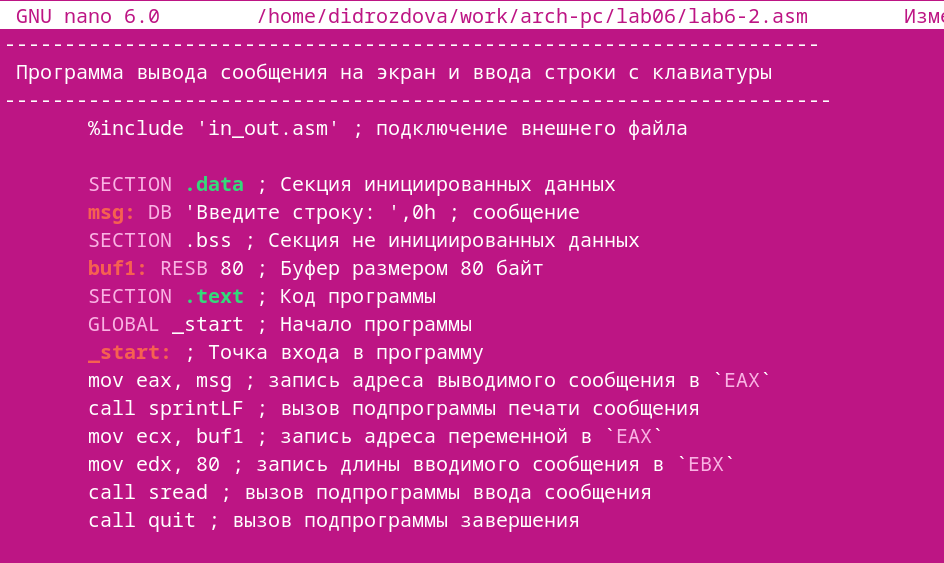{ width=70% }
   
   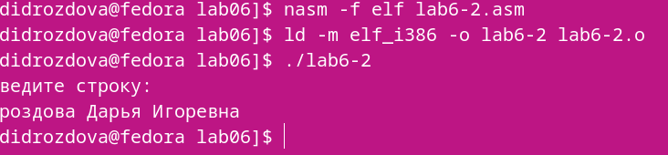{ width=70% }
   
   * В файле lab6-2.asm заменяем подпрограмму sprintLF на sprint, создаем исполняемый файл и проверяем его работу:
   
   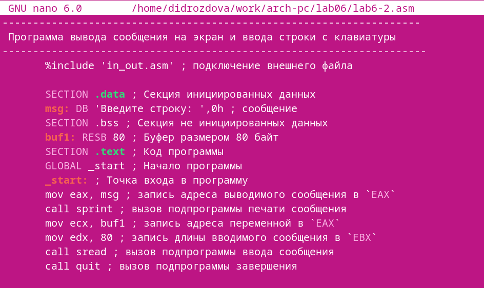{ width=70% }

   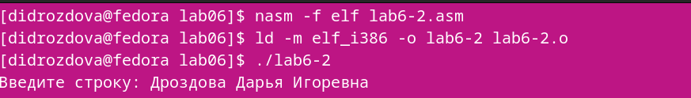{ width=70% }
   
   Заметим разницу между командами sprintLF и sprint: в первом случае ввод осуществляется с новой строки, а во втором - сразу после выводимого текста.

3. Задание для самостоятельной работы
   * Делаем копию файла lab6-1.asm, вносим изменения в программу, без использования команд из файла in_out.asm, чтобы программа работала по следующщему алгоритму:
  - вывести приглашение типа “Введите строку:”;
  - ввести строку с клавиатуры;
  - вывести введённую строку на экран.
  
  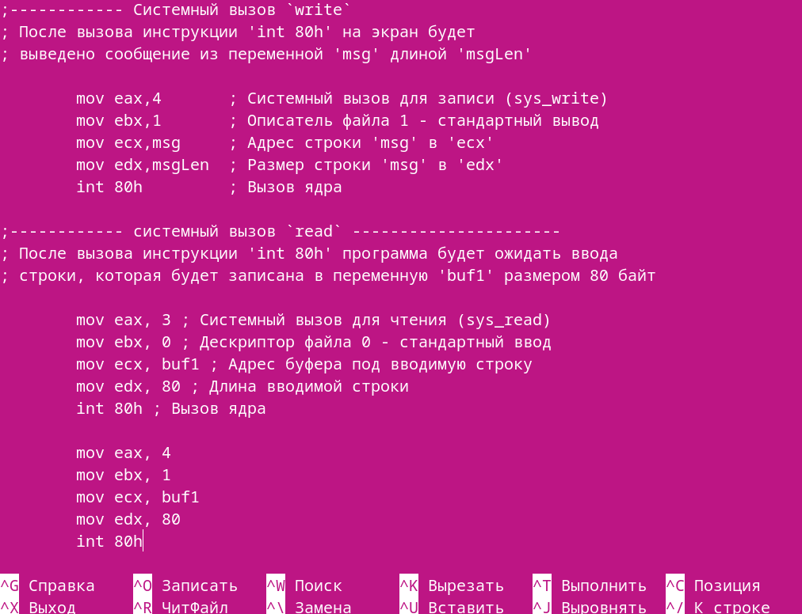{ width=70% }
  
  Создаем исполняемый файл и проверяем его работу:
  
  { width=70% }
  
  { width=70% }
  
  * Создаем копию файла lab6-2.asm и исправляем текст программы с использование подпрограмм из внешнего файла in_out.asm, так чтобы она работала по следующему алгоритму:
   - вывести приглашение типа “Введите строку:”;
   - ввести строку с клавиатуры;
   - вывести введённую строку на экран.
   
   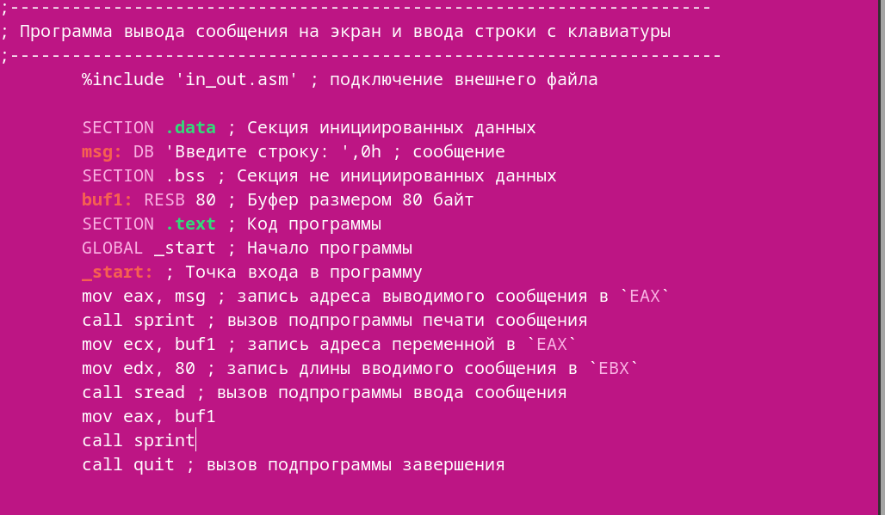{ width=70% }
   
   Создаем исполняемый файл и проверяем его работу:
   
   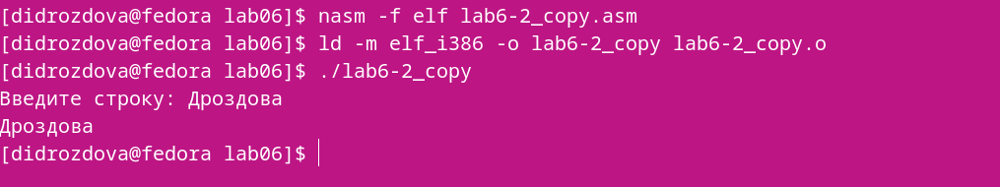{ width=70% }
   
# Выводы

В ходе выполнения практических заданий “Лабораторной работы №5” я
приобрела практические навыки работы в Midnight Commander и освоила инструкции языка ассемблера mov и int.
