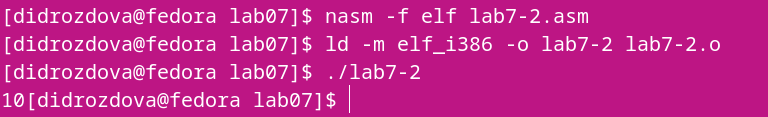

---
## Front matter
title: "Отчет по лабораторной работе № 6"
subtitle: "Дисциплина: Архитектура компьютера"
author: "Дроздова Дарья Игоревна"

## Generic otions
lang: ru-RU
toc-title: "Содержание"

## Bibliography
bibliography: bib/cite.bib
csl: pandoc/csl/gost-r-7-0-5-2008-numeric.csl

## Pdf output format
toc: true # Table of contents
toc-depth: 2
fontsize: 12pt
linestretch: 1.5
papersize: a4
documentclass: scrreprt

## I18n polyglossia
polyglossia-lang:
  name: russian
  options:
	- spelling=modern
	- babelshorthands=true
polyglossia-otherlangs:
  name: english
## I18n babel
babel-lang: russian
babel-otherlangs: english
## Fonts
mainfont: PT Serif
romanfont: PT Serif
sansfont: PT Sans
monofont: PT Mono
mainfontoptions: Ligatures=TeX
romanfontoptions: Ligatures=TeX
sansfontoptions: Ligatures=TeX,Scale=MatchLowercase
monofontoptions: Scale=MatchLowercase,Scale=0.9
## Biblatex
biblatex: true
biblio-style: "gost-numeric"
biblatexoptions:
  - parentracker=true
  - backend=biber
  - hyperref=auto
  - language=auto
  - autolang=other*
  - citestyle=gost-numeric
## Pandoc-crossref LaTeX customization
figureTitle: "Рис."
tableTitle: "Таблица"
listingTitle: "Листинг"
lofTitle: "Список иллюстраций"
lotTitle: "Список таблиц"
lolTitle: "Листинги"
## Misc options
indent: true
header-includes:
  - \usepackage{indentfirst}
  - \usepackage{float} # keep figures where there are in the text
  - \floatplacement{figure}{H} # keep figures where there are in the text
---

# Цель работы

Целью данной лабораторной работы является освоение арифметических инструкций языка ассемблера NASM.                                           

# Выполнение лабораторной работы

1. **Символьные и численные данные в NASM**
   - Создаем каталог для программ лабораторной работы №6, переходим в
него и создаем файл lab7-1.asm:

   { width=70% }
   
   -  Рассмотрим примеры программ вывода символьных и численных значений.
   
   *Пример №1:*
   Изучаем текст программы из листинга 7.1 и помещаем его в файл lab7-1.asm:
   
   { width=70% }
   
   Создаем исполняемый файл и запускаем его:
   
   { width=70% }
   
   { width=70% }
   
   Результатом выполнения программы является символ 'j'. Так вышло потому, что код символа 6 равен 00110110(54) в двоичном(десятичном) представлении, а код символа 4 – 00110100(52). Команда add eax,ebx запишет в регистр eax сумму кодов – 01101010(106), которая является кодом символа 'j'.
   
   *Пример №2:*
   Изменим текст программы(из листинга 7.1) и вместо символов '4' и '6', запишем в регистры числа:
   
   { width=70% }
   
   Создаем исполняемый файл и запускаем его:
   
   { width=70% }
   
   Результатом выполнения данной программы является пустая строка. Действительно, если мы обратимся к ASCII таблице, то заметим, что сумма 6 и 4, равная 10, является кодом, отвечающим за перенос курсора на другую строку. 
   
   - Воспользуемся подпрограммами для преобразования ASCII символов в числа и обратно(подпрограммы подключаем из файла in_out.asm).
   Создаем файл lab7-2.asm в каталоге ~/work/arch-pc/lab07 и вводим в него
текст программы из листинга 7.2:
   
   { width=70% }
   
   { width=70% }
   
   Создаем исполняемый файл и запускаем его:
   
   { width=70% }
   
   { width=70% }
   
   Как и в первом случае, команда add складывает коды символов ‘6’ и ‘4’ (54+52=106). Однако, в отличии от программы из листинга 7.1, функция iprintLF позволяет вывести
число, а не символ, кодом которого является это число.

   - Аналогично предыдущему примеру изменим символы на числа:
   
   { width=70% }
   
   Создаем исполняемый файл и запускаем его:
   
   { width=70% }
   
   - Теперь заменим функцию iprintLF на iprint. Создаем исполняемый файл и запускаем его:
   
   { width=70% }
   
   { width=70% }
   
   Заменив функцию, мы замечаем, что после вывода результата каретка не перемещается на строку ниже.
   
2. **Выполнение арифметических операций в NASM**
   
   - В качестве примера выполнения арифметических операций в NASM при-
ведем программу вычисления арифметического выражения f(x) = (5 * 2 + 3)/3.
   Создаем файл lab7-3.asm в каталоге ~/work/arch-pc/lab07:
   
   { width=70% }
   
   - Внимательно изучаем текст программы из листинга 7.3 и введим в lab7-3.asm:
   
   { width=70% }
   
   Создаем исполняемый файл и запускаем его:
   
   { width=70% }
   
   - Изменяем текст программы для вычисления выражения f(x) = (4 * 6 + 2)/5.
   
   { width=70% }
   
   Создаем исполняемый файл и проверяем его работу:
   
   { width=70% }
   
   - В качестве другого примера рассмотрим программу вычисления варианта задания по номеру студенческого билета, работающую по следующему алгоритму:
   вывести запрос на введение № студенческого билета;
   вычислить номер варианта по формуле: (S mod 20) + 1, где S – номер студенческого билета (В данном случае a mod b– это остаток от деления a на b);
   вывести на экран номер варианта.
    
    Создаем файл variant.asm в каталоге ~/work/arch-pc/lab07, внимательно изучаем листинг 7.4 и вводим текст программы в файл variant.asm:
    
    { width=70% }
    
    Создаем исполняемый файл и запускаем его:
    
    { width=70% }
    
    { width=70% }
    
    Проверяем результат работы программы, вычислив номер варианта аналитически(результат верный).

3. **Вопросы**

   1. Какие строки листинга 7.4 отвечают за вывод на экран сообщения ‘Ваш
вариант:’?

   mov eax,rem   
   call sprint  

   2. Для чего используется следующие инструкции?   

   mov ecx, x   #запись адреса переменной х в "EAX"  
   mov edx, 80  #запись длины вводимого сообщения в "EBX"  
   call sread   #вызов подпрограммы ввода сообщения  
   
   3. Для чего используется инструкция “call atoi”?

    Для преобразования ASCII кода символа в число
   
   4. Какие строки листинга 7.4 отвечают за вычисления варианта?
   
     mov eax,x   
     call atoi   
     xor edx,edx  
     mov ebx,20  
     div ebx  
     inc edx  
   
   5. В какой регистр записывается остаток от деления при выполнении инструкции “div ebx”?
   
   В регистр edx.
   
   6. Для чего используется инструкция “inc edx”?
   
   Увеличивает значение регистра ebx на 1
   
   7. Какие строки листинга 7.4 отвечают за вывод на экран результата вычислений?
   
   mov eax,edx
   call iprintLF  
   
4. **Задание для самостоятельной работы**

   В соответствии с вариантом(в моем случае - вариант №7) пишем программу функции: 
y = 5(x − 1)2   

   - Создаем файл function.asm в каталоге ~/work/arch-pc/lab07:
   
   { width=70% }
   
   - В файле function.asm пишем программу, вычисляющую значение функции при x1=3 и x2=5:
   
   { width=70% }
   
   { width=70% }
   
   - Создаем исполняемый файл, запускаем его и вводим с клавиатуры значения переменной x:
   
   { width=70% }
   
   Результат работы программы корректен.
   

# Выводы

В ходе выполнения данной лабораторной работы я освоила арифметические инструкции языка ассемблера NASM: сложение, вычитание, умножение, целое и дробное деление, а так же смена знача числа.

